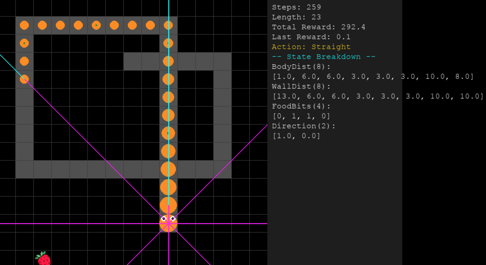
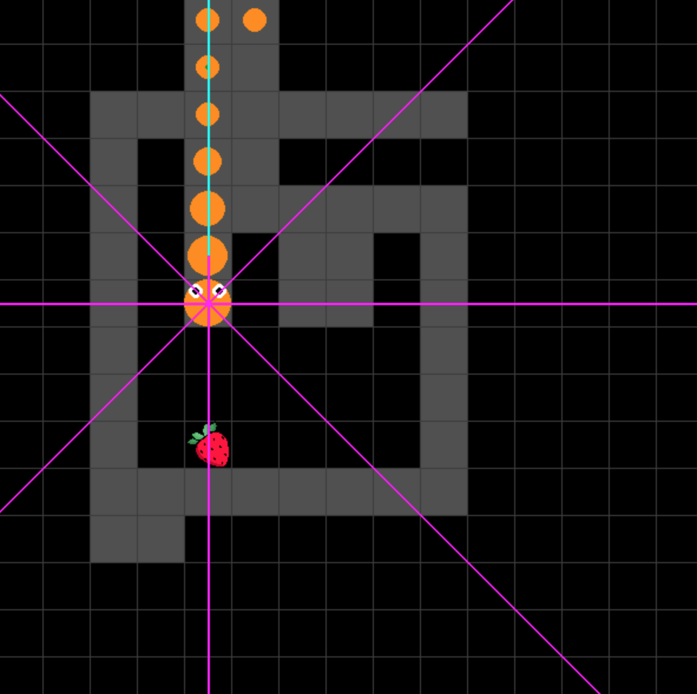
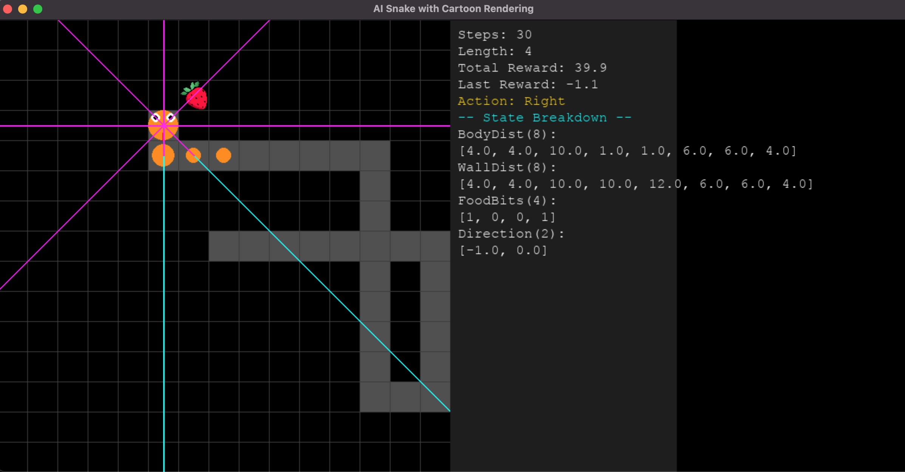
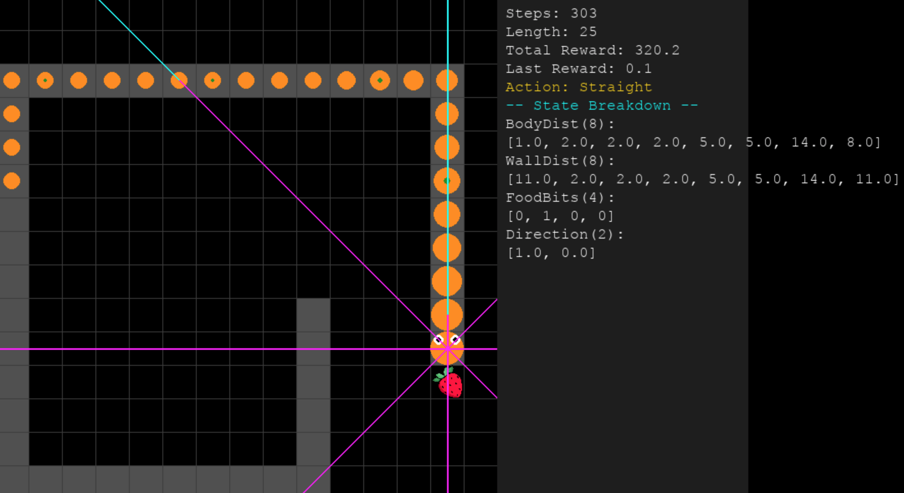

# 🐍 Snake Reinforcement Learning (DQN)

A **Snake game** powered by **Reinforcement Learning** using **Deep Q-Networks (DQN)**.  




A Snake game enhanced by Reinforcement Learning using Deep Q-Networks (DQN).
Our goal is to train an AI agent to master Snake by learning optimal movement strategies through trial and error—and it succeeded.

In this document, we'll cover the key aspects of the project, including setup, training, and improvements. You can download and run the AI-powered Snake on your computer and even enhance its capabilities further.

Currently, our trained model with 22 inputs, 3 output actions and 3 of 256 neurons hidden layer that can survive up to 300 steps in a 15×15 grid environment with fewer than 2,000 training episodes, which is quite impressive! Below is the training history:

```
<ipython-input-6-1514ff8b5c37>:284: FutureWarning: You are using `torch.load` with `weights_only=False` (the current default value), which uses the default pickle module implicitly. It is possible to construct malicious pickle data which will execute arbitrary code during unpickling (See https://github.com/pytorch/pytorch/blob/main/SECURITY.md#untrusted-models for more details). In a future release, the default value for `weights_only` will be flipped to `True`. This limits the functions that could be executed during unpickling. Arbitrary objects will no longer be allowed to be loaded via this mode unless they are explicitly allowlisted by the user via `torch.serialization.add_safe_globals`. We recommend you start setting `weights_only=True` for any use case where you don't have full control of the loaded file. Please open an issue on GitHub for any issues related to this experimental feature.
  old_weights = torch.load(OLD_CHECKPOINT_PATH, map_location="cpu")
Loaded old model from: best_dqn_snake.pth
🔥 New Best Model at Episode 1 | Reward: -31.90
🔥 New Best Model at Episode 3 | Reward: -23.30
🔥 New Best Model at Episode 6 | Reward: -22.00
🔥 New Best Model at Episode 9 | Reward: -17.00
🔥 New Best Model at Episode 16 | Reward: -13.85
Episode 50 | Avg Reward (last 50): -46.29 | Avg Steps: 59.3 | Epsilon: 0.778
🔥 New Best Model at Episode 51 | Reward: -12.25
🔥 New Best Model at Episode 64 | Reward: -7.50
🔥 New Best Model at Episode 74 | Reward: 4.90
🔥 New Best Model at Episode 90 | Reward: 9.10
Episode 100 | Avg Reward (last 50): -29.90 | Avg Steps: 54.0 | Epsilon: 0.606
🔥 New Best Model at Episode 111 | Reward: 9.70
Episode 150 | Avg Reward (last 50): -13.15 | Avg Steps: 51.4 | Epsilon: 0.471
🔥 New Best Model at Episode 155 | Reward: 24.75
🔥 New Best Model at Episode 156 | Reward: 45.45
Episode 200 | Avg Reward (last 50): 0.11 | Avg Steps: 58.5 | Epsilon: 0.367
🔥 New Best Model at Episode 239 | Reward: 69.40
Episode 250 | Avg Reward (last 50): 8.64 | Avg Steps: 54.8 | Epsilon: 0.286
🔥 New Best Model at Episode 273 | Reward: 74.40
🔥 New Best Model at Episode 274 | Reward: 87.85
🔥 New Best Model at Episode 282 | Reward: 89.10
Episode 300 | Avg Reward (last 50): 29.57 | Avg Steps: 71.0 | Epsilon: 0.222
🔥 New Best Model at Episode 316 | Reward: 143.65
Episode 350 | Avg Reward (last 50): 36.42 | Avg Steps: 64.8 | Epsilon: 0.173
🔥 New Best Model at Episode 353 | Reward: 147.95
🔥 New Best Model at Episode 382 | Reward: 190.90
Episode 400 | Avg Reward (last 50): 52.74 | Avg Steps: 88.0 | Epsilon: 0.135
🔥 New Best Model at Episode 434 | Reward: 229.10
Episode 450 | Avg Reward (last 50): 76.66 | Avg Steps: 93.8 | Epsilon: 0.105
🔥 New Best Model at Episode 470 | Reward: 237.40
🔥 New Best Model at Episode 473 | Reward: 303.70
Episode 500 | Avg Reward (last 50): 129.16 | Avg Steps: 148.9 | Epsilon: 0.082
🔥 New Best Model at Episode 516 | Reward: 310.95
🔥 New Best Model at Episode 526 | Reward: 313.55
🔥 New Best Model at Episode 531 | Reward: 456.75
Episode 550 | Avg Reward (last 50): 141.16 | Avg Steps: 145.7 | Epsilon: 0.063
Episode 600 | Avg Reward (last 50): 170.39 | Avg Steps: 179.4 | Epsilon: 0.049
🔥 New Best Model at Episode 606 | Reward: 494.60
Episode 650 | Avg Reward (last 50): 207.80 | Avg Steps: 205.6 | Epsilon: 0.038
🔥 New Best Model at Episode 700 | Reward: 520.30
Episode 700 | Avg Reward (last 50): 200.23 | Avg Steps: 205.3 | Epsilon: 0.030
🔥 New Best Model at Episode 707 | Reward: 551.00
🔥 New Best Model at Episode 740 | Reward: 571.85
Episode 750 | Avg Reward (last 50): 253.26 | Avg Steps: 246.9 | Epsilon: 0.023
Episode 800 | Avg Reward (last 50): 266.51 | Avg Steps: 256.8 | Epsilon: 0.018
Episode 850 | Avg Reward (last 50): 294.26 | Avg Steps: 288.8 | Epsilon: 0.014
🔥 New Best Model at Episode 880 | Reward: 660.65
Episode 900 | Avg Reward (last 50): 308.83 | Avg Steps: 295.7 | Epsilon: 0.011
Episode 950 | Avg Reward (last 50): 320.90 | Avg Steps: 297.2 | Epsilon: 0.010
Episode 1000 | Avg Reward (last 50): 325.47 | Avg Steps: 309.6 | Epsilon: 0.010
Episode 1050 | Avg Reward (last 50): 293.00 | Avg Steps: 299.6 | Epsilon: 0.010
Episode 1100 | Avg Reward (last 50): 314.90 | Avg Steps: 303.3 | Epsilon: 0.010
🔥 New Best Model at Episode 1150 | Reward: 684.10
Episode 1150 | Avg Reward (last 50): 342.21 | Avg Steps: 333.5 | Epsilon: 0.010
Episode 1200 | Avg Reward (last 50): 356.30 | Avg Steps: 344.5 | Epsilon: 0.010
Episode 1250 | Avg Reward (last 50): 339.32 | Avg Steps: 313.6 | Epsilon: 0.010
Episode 1300 | Avg Reward (last 50): 353.27 | Avg Steps: 334.5 | Epsilon: 0.010
Episode 1350 | Avg Reward (last 50): 323.21 | Avg Steps: 308.6 | Epsilon: 0.010
Episode 1400 | Avg Reward (last 50): 363.05 | Avg Steps: 363.7 | Epsilon: 0.010
Episode 1450 | Avg Reward (last 50): 311.47 | Avg Steps: 298.2 | Epsilon: 0.010
🔥 New Best Model at Episode 1487 | Reward: 739.30
Episode 1500 | Avg Reward (last 50): 307.62 | Avg Steps: 300.8 | Epsilon: 0.010
Episode 1550 | Avg Reward (last 50): 347.27 | Avg Steps: 329.5 | Epsilon: 0.010
Episode 1600 | Avg Reward (last 50): 326.20 | Avg Steps: 318.7 | Epsilon: 0.010
Episode 1650 | Avg Reward (last 50): 336.87 | Avg Steps: 330.3 | Epsilon: 0.010
Episode 1700 | Avg Reward (last 50): 340.04 | Avg Steps: 316.0 | Epsilon: 0.010
```

[See more on Google Colab](https://colab.research.google.com/drive/1IWUgCjsTLKXD9lMjex4sIpEj780ghPfB?usp=sharing)

---

## 📌 Features
- **Deep Q-Network (DQN)** for AI decision-making
- **Reinforcement Learning applied to Snake**
- **Optimized reward function for better learning**
- **PyTorch support**

---

## 🎮 How to Run
### 1️⃣ Install Dependencies  
Make sure you have Python installed, then run:

```sh
pip install -r requirements.txt
```

### 2️⃣ Train the AI
To start training the Snake AI:

```sh
python training/train1.py
```

### 3️⃣ Play with the Trained Model
Once trained, run:

```sh
python tests/level1.py
```

---

## 🖼️ Screenshots

Here are some screenshots of the AI learning and playing the game:






---

## 🚀 Future Improvements
If you want to expirement more you can go far with this project by considering the followings:
- 🔥 Implement PPO / A3C for comparison
- 🏆 Optimize training efficiency
- 🎥 Add a demo video of the AI playing Snake

This project serves as a demonstration of the powerful capabilities that **Reinforcement Learning (RL)** brings to life. Beyond this showcase, RL has a vast range of real-world applications, including **autonomous driving**, **healthcare automation**, **robotic process optimization**, **industrial control systems**, **financial modeling**, and much more. By leveraging RL, we can develop intelligent systems that learn and adapt to complex environments, making decisions under pressure that optimize efficiency and maximize outcome, safety, and performance across various industries.

---

## 👨‍💻 Author
**Abdllatif Mokafih**  
📌 GitHub: [@Abdllatif-max](https://github.com/Abdllatif-max)  

---

## ⭐ Contribute & Support
- **Star** 🌟 this repo if you like it!
- **Pull Requests** are welcome for improvements.
